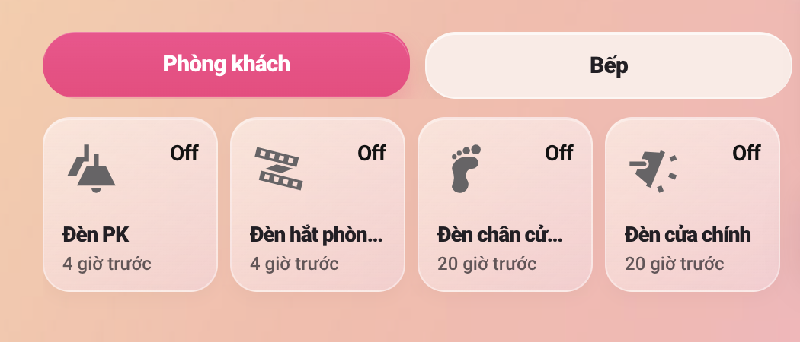

# Soft Room Card

Card multiroom cho Home Assistant (`custom:soft-room-card`).

[](https://my.home-assistant.io/redirect/hacs_repository/?owner=hd00842&repository=Soft-Room-Card&category=plugin)

GitHub: https://github.com/hd00842/Soft-Room-Card.git

## Preview



## Cài đặt

### Cách 1: HACS (khuyến nghị)
1. Nhấn nút **Add to HACS** ở trên.
2. Cài `Soft Room Card`.
3. Restart Home Assistant.
4. Vào Dashboard -> **Add card** -> chọn `Soft Room Card`.

### Cách 2: Thủ công
1. Copy file `soft-room-card.js` vào:
```text
/config/www/soft-room-card.js
```
2. Thêm resource:
```yaml
url: /local/soft-room-card.js
type: module
```
3. Reload trình duyệt và thêm card.

## Cấu hình nhanh

```yaml
type: custom:soft-room-card
theme: pastel
room_display: tabs
layout: scroll
columns: 4
tile_width: 160
tile_height: 160
secondary_info: last-changed
rooms:
  - title: Phòng khách
    accent_color: "#eb3e7c"
    items:
      - entity: light.den_phong_khach
        name: Đèn phòng khách
        icon: mdi:ceiling-light
      - entity: switch.quat_phong_khach
        name: Quạt phòng khách
        icon: mdi:fan
  - title: Bếp
    layout: grid
    columns: 3
    items:
      - entity: light.den_bep
      - entity: switch.may_hut_mui
```

## Cấu hình chính

- Cấp card: `theme`, `room_display`, `layout`, `columns`, `tile_width`, `tile_height`, `secondary_info`, `background`, `surface_color`, `border_color`, `accent_color`, `text_color`, `muted_text_color`, `state_text_color`, `tab_background_color`, `rooms`.
- Cấp room: `title`, `accent_color`, `layout`, `columns`, `tile_width`, `tile_height`, `items`.
- Cấp item: `entity`, `name`, `icon`, `secondary_info`, `tap_action`, `hold_action`, `double_tap_action`.
- Action hỗ trợ: `toggle`, `more-info`, `navigate`, `url`, `call-service`, `none`.
